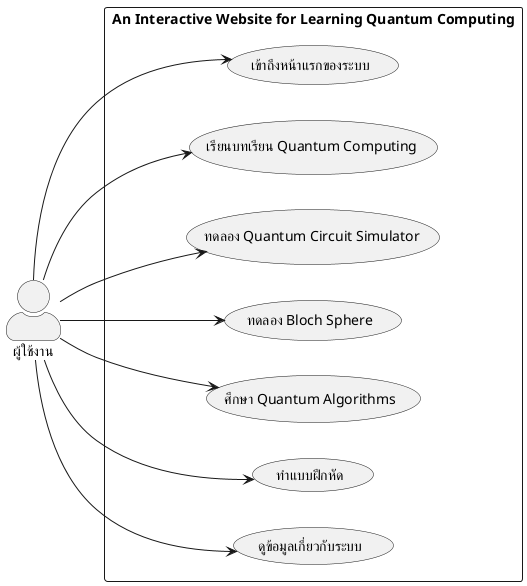
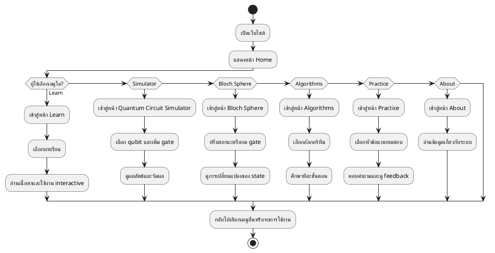
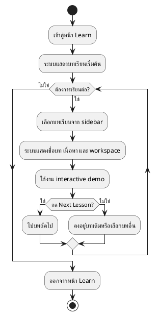
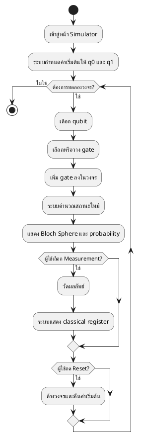
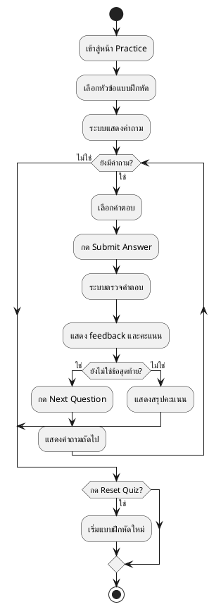

# รายงานโครงงาน 5 บท

## ชื่อโครงงาน

An Interactive Website for Learning Quantum Computing

## ผู้จัดทำ

- ชื่อ-นามสกุล: ........................................
- รหัสนักศึกษา: ........................................
- สาขาวิชา: ........................................
- อาจารย์ที่ปรึกษา: ........................................

---

# บทที่ 1 บทนำ

## 1.1 หลักการและเหตุผล

Quantum Computing เป็นสาขาที่มีความสำคัญเพิ่มขึ้นอย่างต่อเนื่องในวงการวิทยาการคอมพิวเตอร์ เนื่องจากแนวคิดเรื่องคิวบิต การซ้อนทับสถานะ การพัวพันเชิงควอนตัม และอัลกอริทึมควอนตัม สามารถเปิดโอกาสให้การประมวลผลบางประเภททำได้อย่างมีประสิทธิภาพกว่าคอมพิวเตอร์แบบดั้งเดิม อย่างไรก็ตาม เนื้อหาในสาขานี้มักมีความเป็นนามธรรมสูง ทำให้ผู้เริ่มต้นเรียนรู้เข้าใจได้ยากหากอาศัยเพียงการอ่านทฤษฎีหรือดูสมการเพียงอย่างเดียว

จากปัญหาดังกล่าว ผู้จัดทำจึงพัฒนาเว็บไซต์เชิงโต้ตอบสำหรับการเรียนรู้ Quantum Computing โดยออกแบบให้ผู้ใช้สามารถเรียนรู้ตั้งแต่แนวคิดพื้นฐาน เช่น Qubit และ Superposition ไปจนถึงแนวคิดที่ซับซ้อนขึ้น เช่น Quantum Gates, Entanglement, Quantum Circuits และ Quantum Algorithms ผ่านสื่อการสอนที่มีลักษณะ interactive ผู้ใช้สามารถเห็นผลจากการปรับค่าหรือกดปุ่มต่าง ๆ ได้ทันที ซึ่งช่วยลดความซับซ้อนของเนื้อหาเชิงนามธรรม และเปลี่ยนให้การเรียนรู้เป็นประสบการณ์ที่เข้าใจได้ง่ายขึ้น

ระบบที่พัฒนาขึ้นไม่ได้เป็นเพียงเว็บไซต์ข้อมูลทั่วไป แต่เป็นแพลตฟอร์มการเรียนรู้ที่รวมบทเรียนเชิงโต้ตอบ ตัวจำลองวงจรควอนตัม การแสดงผลบน Bloch Sphere การเรียนรู้อัลกอริทึมควอนตัมแบบเป็นลำดับขั้น และแบบฝึกหัดเพื่อประเมินความเข้าใจไว้ในระบบเดียว จึงเหมาะสำหรับใช้เป็นสื่อการสอนเบื้องต้นสำหรับนักเรียน นักศึกษา หรือผู้สนใจทั่วไป

## 1.2 วัตถุประสงค์ของโครงงาน

1. เพื่อพัฒนาเว็บไซต์สำหรับการเรียนรู้ Quantum Computing ในรูปแบบ interactive
2. เพื่อช่วยให้ผู้ใช้งานเข้าใจแนวคิดพื้นฐานของ Quantum Computing ได้ง่ายขึ้นผ่านภาพและการโต้ตอบ
3. เพื่อพัฒนาโมดูลจำลองวงจรควอนตัมและการแสดงผลสถานะคิวบิตบน Bloch Sphere
4. เพื่อพัฒนาเนื้อหาและกิจกรรมการเรียนรู้เกี่ยวกับ Quantum Algorithms ที่สำคัญ
5. เพื่อจัดทำแบบฝึกหัดสำหรับทบทวนและประเมินความเข้าใจของผู้เรียน

## 1.3 ขอบเขตของโครงงาน

โครงงานนี้มีขอบเขตการพัฒนาในส่วนของเว็บไซต์หลายหน้า โดยประกอบด้วยโมดูลหลักดังนี้

1. หน้า Home สำหรับนำเสนอภาพรวมของระบบและเข้าถึงโมดูลต่าง ๆ
2. หน้า Learn สำหรับแสดงบทเรียนจำนวน 10 บท แบ่งเป็นระดับพื้นฐาน ระดับกลาง และระดับสูง
3. หน้า Quantum Circuit Simulator สำหรับทดลองเพิ่ม gate, วัดผล และดูการเปลี่ยนแปลงของสถานะคิวบิต
4. หน้า Bloch Sphere สำหรับควบคุมสถานะคิวบิตด้วย slider และ gate buttons พร้อมการแสดงผลแบบ 3 มิติ
5. หน้า Algorithms สำหรับอธิบายอัลกอริทึม Deutsch, Grover, Quantum Teleportation และ Shor
6. หน้า Practice สำหรับทำแบบฝึกหัดแบบปรนัยพร้อม feedback ทันที
7. หน้า About สำหรับอธิบายที่มาและวัตถุประสงค์ของแพลตฟอร์ม

ขอบเขตของโครงงานนี้ยังไม่ครอบคลุมระบบสมาชิก การบันทึกผลการเรียนรายบุคคล การจัดเก็บข้อมูลในฐานข้อมูล การวิเคราะห์ผลการใช้งานเชิงสถิติ และการเชื่อมต่อกับเครื่องคอมพิวเตอร์ควอนตัมจริง

## 1.4 ประโยชน์ที่คาดว่าจะได้รับ

1. ได้เว็บไซต์สื่อการเรียนรู้ Quantum Computing ที่ใช้งานง่ายและเข้าใจได้ด้วยตนเอง
2. ช่วยให้ผู้เริ่มต้นเห็นภาพแนวคิดเชิงนามธรรมของ Quantum Computing ได้ชัดเจนขึ้น
3. เป็นสื่อประกอบการเรียนการสอนในรายวิชาที่เกี่ยวข้องกับควอนตัมหรือคอมพิวเตอร์เชิงคำนวณ
4. เป็นพื้นฐานสำหรับการพัฒนาระบบต่อยอด เช่น การเพิ่มแบบทดสอบขั้นสูงหรือระบบติดตามผลผู้เรียน

---

# บทที่ 2 เอกสารและทฤษฎีที่เกี่ยวข้อง

## 2.1 แนวคิดพื้นฐานของ Quantum Computing

Quantum Computing เป็นแนวทางการคำนวณที่อาศัยหลักการของกลศาสตร์ควอนตัมในการแทนและประมวลผลข้อมูล หน่วยข้อมูลพื้นฐานเรียกว่า Qubit ซึ่งต่างจากบิตในคอมพิวเตอร์ทั่วไปที่มีค่าได้เพียง 0 หรือ 1 เนื่องจาก Qubit สามารถอยู่ในสถานะซ้อนทับระหว่าง 0 และ 1 ได้ในเวลาเดียวกัน

## 2.2 Qubit

Qubit เป็นหน่วยข้อมูลพื้นฐานของระบบควอนตัม โดยสามารถแทนสถานะได้ในรูป

`|ψ⟩ = α|0⟩ + β|1⟩`

เมื่อ `α` และ `β` เป็นค่าความกว้างคลื่นเชิงซ้อนที่สัมพันธ์กับความน่าจะเป็นของการวัดผล หากทำการวัดสถานะของ Qubit ระบบจะยุบตัวไปเป็น `|0⟩` หรือ `|1⟩` ตามค่าความน่าจะเป็นของแต่ละสถานะ

ในโครงงานนี้ แนวคิดเรื่อง Qubit ถูกนำเสนอผ่านบทเรียนพื้นฐานในหน้า Learn และถูกแสดงเชิงภาพด้วย probability bars, การวัดผล และการแสดงผลบน Bloch Sphere

## 2.3 Superposition

Superposition คือคุณสมบัติที่ทำให้ Qubit สามารถแทนหลายสถานะพร้อมกันได้ ซึ่งเป็นหัวใจสำคัญที่ทำให้ Quantum Computing มีศักยภาพสูงกว่าการคำนวณแบบคลาสสิกในบางโจทย์ ในเว็บไซต์นี้ มีทั้งบทเรียนอธิบาย Superposition แบบพื้นฐานและแบบเชิงลึก รวมถึงการทดลองวัดผลเพื่อให้ผู้เรียนเห็นว่าแม้คิวบิตจะอยู่ในสถานะผสม แต่เมื่อวัดผลแล้วจะได้ผลลัพธ์เพียงค่าเดียว

## 2.4 Bloch Sphere

Bloch Sphere เป็นเครื่องมือสำหรับแสดงสถานะของ Qubit หนึ่งตัวในลักษณะ 3 มิติ โดยใช้มุม `θ` และ `φ` แทนตำแหน่งของเวกเตอร์สถานะบนทรงกลม ทำให้สามารถมองเห็นการเปลี่ยนแปลงของสถานะเมื่อผ่าน gate ต่าง ๆ ได้อย่างชัดเจน

ในโครงงานนี้ มีการพัฒนาโมดูล Bloch Sphere โดยใช้ Three.js และสร้าง class สำหรับควบคุมการเรนเดอร์ การหมุน และการอัปเดตเวกเตอร์สถานะ เพื่อช่วยให้ผู้ใช้เข้าใจว่าการใช้ gate แต่ละชนิดสัมพันธ์กับการหมุนเวกเตอร์อย่างไร

## 2.5 Quantum Gates

Quantum Gate เป็นตัวดำเนินการที่ใช้เปลี่ยนสถานะของ Qubit โดยโครงงานนี้รองรับ gate พื้นฐานสำคัญ ได้แก่

- Pauli-X สำหรับสลับสถานะ `|0⟩` และ `|1⟩`
- Pauli-Y สำหรับหมุนสถานะรอบแกน Y
- Pauli-Z สำหรับเปลี่ยน phase ของสถานะ
- Hadamard Gate สำหรับสร้าง Superposition
- Measurement สำหรับวัดผลและทำให้สถานะยุบตัว

ในส่วนของ Quantum Circuit Simulator และ Bloch Sphere ผู้ใช้สามารถทดลองใช้ gate เหล่านี้และดูผลลัพธ์ได้ทันที

## 2.6 Quantum Entanglement

Entanglement หรือความพัวพันเชิงควอนตัม เป็นปรากฏการณ์ที่สถานะของ Qubit หลายตัวมีความสัมพันธ์กันจนไม่สามารถอธิบายแยกจากกันได้ โครงงานนี้นำเสนอแนวคิดดังกล่าวผ่านบทเรียนเฉพาะทางในหน้า Learn และผ่านตัวอย่างในหน้า Algorithms โดยเฉพาะ Quantum Teleportation

## 2.7 Quantum Circuits

Quantum Circuit เป็นรูปแบบการจัดลำดับการทำงานของ Qubit และ Gate ในลักษณะเส้นเวลา โดยอ่านจากซ้ายไปขวา ในเว็บไซต์นี้ หน้า Simulator ได้จำลองแนวคิดดังกล่าวผ่าน wire ของ `q0`, `q1` และ classical register `c` ให้ผู้ใช้เห็นลำดับการวาง gate และผลลัพธ์หลัง measurement

## 2.8 Quantum Algorithms ที่เกี่ยวข้อง

โครงงานนี้นำเสนออัลกอริทึมควอนตัมที่สำคัญ 4 รายการ ได้แก่

1. Deutsch Algorithm สำหรับแยกแยะฟังก์ชันแบบ constant และ balanced
2. Grover Search สำหรับค้นหาในข้อมูลที่ไม่เรียงลำดับด้วยแนวคิด amplitude amplification
3. Quantum Teleportation สำหรับอธิบายการส่งผ่านสถานะควอนตัมด้วย entanglement และ classical bits
4. Shor Algorithm สำหรับการหา period และการแยกตัวประกอบจำนวน

## 2.9 เทคโนโลยีที่ใช้ในการพัฒนา

เทคโนโลยีหลักที่ใช้ในโครงงานประกอบด้วย

- HTML สำหรับโครงสร้างของหน้าเว็บ
- CSS สำหรับกำหนดรูปแบบการแสดงผล
- JavaScript สำหรับตรรกะและการโต้ตอบของระบบ
- Vite สำหรับจัดการการพัฒนาและ build แบบหลายหน้า
- Three.js สำหรับแสดงผลกราฟิก 3 มิติ
- Tailwind CSS ผ่าน CDN สำหรับช่วยจัดวางองค์ประกอบ UI
- Lucide Icons สำหรับไอคอนในส่วนติดต่อผู้ใช้

---

# บทที่ 3 การวิเคราะห์และออกแบบระบบ

## 3.1 ภาพรวมของระบบ

ระบบที่พัฒนาขึ้นเป็นเว็บไซต์แบบหลายหน้า (Multi-page Application) ซึ่งแต่ละหน้ารับผิดชอบหน้าที่เฉพาะ เช่น หน้า Home ใช้สำหรับการเข้าถึงโมดูลต่าง ๆ หน้า Learn ใช้สำหรับศึกษาบทเรียน หน้า Simulator ใช้สำหรับทดลองวงจรควอนตัม และหน้า Practice ใช้สำหรับทำแบบฝึกหัด เป็นต้น

จากการตรวจสอบโครงสร้างโปรเจกต์ผ่าน `vite.config.js` พบว่าระบบถูกกำหนด entry points หลักไว้ 7 หน้า ได้แก่

- `index.html`
- `pages/LearnPage.html`
- `pages/SimulatorPage.html`
- `pages/AlgorithmsPage.html`
- `pages/BlochSphere.html`
- `pages/PracticePage.html`
- `pages/AboutPage.html`

## 3.2 ผู้ใช้งานของระบบ

ผู้ใช้งานหลักของระบบคือผู้เรียนหรือผู้สนใจทั่วไปที่ต้องการศึกษาหลักการของ Quantum Computing โดยไม่มีการแบ่งสิทธิ์ซับซ้อน ระบบจึงถูกออกแบบให้สามารถเข้าถึงเนื้อหาได้ทันทีผ่าน browser โดยไม่ต้องล็อกอิน

## 3.3 ความต้องการเชิงหน้าที่ของระบบ

ระบบควรมีความสามารถดังต่อไปนี้

1. แสดงข้อมูลภาพรวมของแพลตฟอร์มบนหน้าแรก
2. ให้ผู้ใช้เลือกบทเรียนจาก sidebar และศึกษาบทเรียนทีละลำดับได้
3. ให้ผู้ใช้ทดลองกับคิวบิต วัดผล และปรับ probability ผ่าน interactive components
4. ให้ผู้ใช้ทดลองสร้างและแก้ไขวงจรควอนตัมด้วย gate ต่าง ๆ
5. ให้ผู้ใช้ดูการเปลี่ยนแปลงของสถานะคิวบิตบน Bloch Sphere แบบ 3 มิติ
6. ให้ผู้ใช้เรียนรู้อัลกอริทึมควอนตัมแบบ step-by-step
7. ให้ผู้ใช้ทำแบบฝึกหัดและรับ feedback ทันที

## 3.4 ความต้องการเชิงไม่ใช่หน้าที่ของระบบ

1. ระบบควรตอบสนองต่อผู้ใช้ได้รวดเร็ว
2. ส่วนติดต่อผู้ใช้ควรเข้าใจง่ายและเหมาะกับผู้เริ่มต้น
3. เว็บไซต์ควรรองรับการใช้งานบนหน้าจอหลายขนาด
4. การแสดงผลเชิงภาพ เช่น 3D Bloch Sphere ควรลื่นไหลพอสำหรับการเรียนรู้

## 3.5 การออกแบบโครงสร้างเมนูและหน้าใช้งาน

หน้า Home ทำหน้าที่เป็นจุดเริ่มต้นของระบบ โดยมีเมนูนำทางไปยังทุกโมดูลสำคัญ ผู้ใช้สามารถกดปุ่ม `Start Learning` หรือ `Open Simulator` เพื่อเริ่มใช้งานได้ทันที ส่วนหน้ารองแต่ละหน้ามีปุ่มหรือโลโก้สำหรับย้อนกลับมาหน้า Home เพื่อให้การนำทางเป็นไปอย่างต่อเนื่อง

## 3.6 การออกแบบโมดูลบทเรียน

หน้า Learn ถูกออกแบบให้มี sidebar ด้านซ้ายสำหรับเลือกบทเรียน และมีพื้นที่หลักด้านขวาสำหรับเนื้อหาและ interactive workspace จากข้อมูลใน `Lessons.js` พบว่าระบบมีบทเรียนทั้งหมด 10 บท แบ่งเป็น 3 ระดับ ได้แก่

- Quantum Basics
- Intermediate Concepts
- Advanced Concepts

บทเรียนครอบคลุมหัวข้อสำคัญ เช่น Introduction to Quantum Computing, Qubit, Superposition, Bloch Sphere, Quantum Gates, Hadamard Gate, Multiple Qubits, Entanglement, Quantum Circuits และ Quantum Algorithms

## 3.7 การออกแบบโมดูล Quantum Circuit Simulator

หน้า Simulator ถูกออกแบบเป็น 3 ส่วนหลัก

1. ส่วน palette ของ gate ได้แก่ `H`, `X`, `Y`, `Z`, `M`
2. ส่วน circuit composer สำหรับ q0, q1 และ classical register
3. ส่วนแสดงผล ได้แก่ Bloch Sphere และ probability bars

ผู้ใช้สามารถเพิ่ม gate ได้ทั้งจากการคลิกและการลากวาง โดย state ของแต่ละ qubit จะถูกเก็บแยกกัน และคำนวณใหม่จากประวัติ gate ที่เคยใช้งาน

## 3.8 การออกแบบโมดูล Bloch Sphere

โมดูล Bloch Sphere ถูกออกแบบให้มีตัวควบคุม 3 ส่วน ได้แก่

- Initial State
- Theta
- Phi

พร้อมปุ่ม gate สำหรับทดลองการหมุนสถานะ เมื่อผู้ใช้ปรับ slider หรือกด gate ระบบจะคำนวณเวกเตอร์ใหม่และอัปเดต probability ของ `|0⟩` และ `|1⟩` ทันที

## 3.9 การออกแบบโมดูล Algorithms

หน้า Algorithms ถูกออกแบบในลักษณะ step-by-step learning โดยแยกส่วนของ algorithm selector, steps list, progress indicator, explanation panel และ circuit visualization ออกจากกัน ทำให้ผู้ใช้สามารถเรียนตามลำดับหรือเลือกข้ามไปยัง step ที่ต้องการได้

ในกรณีของ Shor Algorithm ได้มีการออกแบบห้องทดลองแบบ interactive เพิ่มเติม ซึ่งให้ผู้ใช้กรอกค่า `N` และ `a` เพื่อดูผลลัพธ์ในแต่ละขั้นของกระบวนการ

## 3.10 การออกแบบโมดูล Practice

หน้า Practice ใช้รูปแบบแบบทดสอบปรนัย โดยมีหัวข้อหลัก 3 หัวข้อ ได้แก่

- Quantum Gates
- Superposition
- Measurement

แต่ละหัวข้อมีคำถามหลายข้อและให้ feedback ทันทีหลังส่งคำตอบ พร้อมทั้งมี progress bar และคะแนนรวมของหัวข้อนั้น

## 3.11 การออกแบบโครงสร้างไฟล์ของระบบ

โครงสร้างหลักของโปรเจกต์ประกอบด้วย

- `pages/` สำหรับไฟล์ HTML ของแต่ละหน้า
- `src/scripts/` สำหรับตรรกะการทำงานของแต่ละหน้า
- `src/styles/` สำหรับไฟล์ CSS
- `src/lib/quantum/` สำหรับ utility และ class ที่เกี่ยวข้องกับ Bloch Sphere และ Quantum Engine

โครงสร้างดังกล่าวช่วยให้แยกหน้าที่ของแต่ละส่วนชัดเจน และรองรับการดูแลรักษาในอนาคตได้ง่ายขึ้น

## 3.12 Use Case Diagram ของระบบ

จากการวิเคราะห์การทำงานของระบบพบว่า actor หลักของเว็บไซต์นี้คือ "ผู้ใช้งาน" หรือ "ผู้เรียน" ซึ่งเป็นผู้เข้าใช้งานเว็บไซต์เพื่อศึกษาบทเรียน ทดลองเครื่องมือเชิงโต้ตอบ และทำแบบฝึกหัดด้วยตนเอง โดยในขอบเขตของโครงงานยังไม่มีระบบสมาชิกหรือผู้ดูแลระบบแยกต่างหาก จึงสามารถสรุปกรณีใช้งานหลักของระบบได้ 7 กรณี ได้แก่ การเข้าถึงหน้าแรกของระบบ การเรียนบทเรียน Quantum Computing การทดลอง Quantum Circuit Simulator การทดลอง Bloch Sphere การศึกษา Quantum Algorithms การทำแบบฝึกหัด และการดูข้อมูลเกี่ยวกับระบบ

โค้ด PlantUML สำหรับ Use Case Diagram สามารถแสดงได้ดังนี้

## 3.13 Use Case Text

เพื่อให้เห็นรายละเอียดของแต่ละกรณีใช้งานอย่างเป็นระบบ ผู้จัดทำได้สรุป Use Case Text ของระบบในตารางที่ 3.1

ตารางที่ 3.1 สรุป Use Case Text ของระบบ

| รหัสกรณีใช้งาน | ชื่อกรณีใช้งาน | Actor | รายละเอียดโดยสรุป | ผลลัพธ์ที่คาดหวัง |
| --- | --- | --- | --- | --- |
| UC-01 | เข้าถึงหน้าแรกของระบบ | ผู้ใช้งาน | ผู้ใช้งานเปิดเว็บไซต์และดูภาพรวมของระบบจากหน้า Home | ระบบแสดงหน้าแรกและสามารถนำทางไปยังโมดูลอื่นได้ |
| UC-02 | เรียนบทเรียน Quantum Computing | ผู้ใช้งาน | ผู้ใช้งานเลือกบทเรียนจากหน้า Learn เพื่อศึกษาเนื้อหาและใช้งาน interactive demo | ระบบแสดงบทเรียน เนื้อหา และกิจกรรมประกอบได้ตรงตามบทที่เลือก |
| UC-03 | ทดลอง Quantum Circuit Simulator | ผู้ใช้งาน | ผู้ใช้งานเลือก qubit เพิ่ม gate วัดผล และรีเซ็ตวงจรได้ | ระบบคำนวณสถานะ qubit และแสดงผลลัพธ์บนตัวจำลองได้ถูกต้อง |
| UC-04 | ทดลอง Bloch Sphere | ผู้ใช้งาน | ผู้ใช้งานปรับสถานะของ qubit ด้วย slider หรือกด gate เพื่อสังเกตการเปลี่ยนแปลง | ระบบอัปเดตเวกเตอร์สถานะและ probability บน Bloch Sphere แบบทันที |
| UC-05 | ศึกษา Quantum Algorithms | ผู้ใช้งาน | ผู้ใช้งานเลือกอัลกอริทึมและศึกษาแต่ละขั้นตอนแบบ step-by-step | ระบบแสดงคำอธิบาย ขั้นตอน และผลของแต่ละอัลกอริทึมได้ |
| UC-06 | ทำแบบฝึกหัด | ผู้ใช้งาน | ผู้ใช้งานเลือกหัวข้อแบบฝึกหัด ตอบคำถาม และตรวจสอบผล | ระบบแสดง feedback คะแนน และลำดับข้อถัดไปได้ถูกต้อง |
| UC-07 | ดูข้อมูลเกี่ยวกับระบบ | ผู้ใช้งาน | ผู้ใช้งานอ่านข้อมูลเกี่ยวกับแพลตฟอร์ม วัตถุประสงค์ และคุณสมบัติของระบบ | ระบบแสดงข้อมูลแนะนำโครงงานและเชื่อมโยงกลับไปยังการเรียนรู้ได้ |

## 3.14 Activity Diagram ของระบบ

ในการวิเคราะห์ขั้นตอนการทำงานของระบบ ผู้จัดทำได้เลือกสรุป Activity Diagram สำหรับ flow สำคัญ 4 ส่วน ได้แก่ ภาพรวมการใช้งานระบบ หน้า Learn หน้า Quantum Circuit Simulator และหน้า Practice เนื่องจากเป็นส่วนที่แสดงพฤติกรรมหลักของผู้ใช้งานได้ชัดเจนและครอบคลุมวัตถุประสงค์ของระบบมากที่สุด

### 3.14.1 Activity Diagram ภาพรวมการใช้งานระบบ

### 3.14.2 Activity Diagram หน้า Learn

### 3.14.3 Activity Diagram หน้า Quantum Circuit Simulator

### 3.14.4 Activity Diagram หน้า Practice

---

# บทที่ 4 การพัฒนาและผลการดำเนินงาน

## 4.1 การพัฒนาโครงสร้างเว็บไซต์

เว็บไซต์นี้พัฒนาแบบ Multi-page ด้วย Vite โดยกำหนด entry points แยกสำหรับแต่ละหน้า ทำให้สามารถพัฒนาและ build หน้าแต่ละส่วนได้ชัดเจนตามหน้าที่ ผู้พัฒนาเลือกใช้ JavaScript แบบแยกไฟล์ตามหน้า เพื่อให้แต่ละโมดูลมีความรับผิดชอบเฉพาะตัวและลดความซับซ้อนของโค้ด

### 4.1.1 โครงสร้างการแบ่งส่วนของระบบ

ในการพัฒนา ผู้จัดทำได้แบ่งระบบออกเป็น 3 ส่วนสำคัญ ได้แก่ ส่วนหน้าเว็บสำหรับการแสดงผล ส่วนตรรกะการทำงานของแต่ละโมดูล และส่วนไลบรารีสำหรับการคำนวณหรือการเรนเดอร์เฉพาะทาง โครงสร้างดังกล่าวช่วยให้การพัฒนาเป็นระบบมากขึ้น โดยส่วนของ `pages/` ทำหน้าที่เก็บไฟล์ HTML ของแต่ละหน้า `src/scripts/` ทำหน้าที่ควบคุมพฤติกรรมของแต่ละโมดูล และ `src/lib/quantum/` ใช้เก็บเครื่องมือทางคณิตศาสตร์และกราฟิกที่เกี่ยวข้องกับ Quantum Computing

### 4.1.2 แนวทางการออกแบบส่วนติดต่อผู้ใช้

ส่วนติดต่อผู้ใช้ของระบบถูกออกแบบให้มีรูปแบบใกล้เคียงกันในหลายหน้า เช่น มีส่วนหัวของหน้า พื้นที่ควบคุมทางด้านซ้าย และพื้นที่แสดงผลหลักทางด้านขวาในบางโมดูล แนวทางนี้ช่วยให้ผู้ใช้งานเรียนรู้รูปแบบการใช้งานของระบบได้รวดเร็ว และลดความสับสนเมื่อต้องสลับใช้งานหลายหน้าในแพลตฟอร์มเดียวกัน

### 4.1.3 ตารางสรุปโมดูลของระบบ

ตารางที่ 4.1 สรุปโมดูลหลักของระบบ

| โมดูล | หน้าที่หลัก | เครื่องมือหรือองค์ประกอบสำคัญ |
| --- | --- | --- |
| Home | แนะนำระบบและนำทางไปยังหน้าต่าง ๆ | Hero section, navigation bar, CTA buttons |
| Learn | แสดงบทเรียนและกิจกรรม interactive | Sidebar lessons, dynamic content, workspace |
| Quantum Circuit Simulator | จำลองวงจรควอนตัมเบื้องต้น | Gates, circuit composer, measurement view |
| Bloch Sphere | แสดงสถานะคิวบิตแบบสามมิติ | Three.js, sliders, quantum gate controls |
| Algorithms | อธิบายอัลกอริทึมแบบ step-by-step | Steps list, progress, Shor Lab |
| Practice | ประเมินความเข้าใจของผู้ใช้ | Quiz topics, scoring, feedback |
| About | สรุปเป้าหมายและคุณค่าของระบบ | Overview content, mission, CTA |

## 4.2 การพัฒนาหน้า Home

หน้า Home ถูกออกแบบให้เป็นจุดเริ่มต้นของผู้ใช้งาน โดยมี hero section ที่สื่อว่าแพลตฟอร์มนี้ใช้สำหรับเรียน Quantum Computing แบบ interactive พร้อมเมนูนำทางไปยังหน้าหลักทั้งหมด นอกจากนี้ยังมี feature cards สำหรับสรุปความสามารถสำคัญของระบบ ได้แก่

- Interactive Visualization
- Quantum Circuit Simulator
- Algorithm Walkthroughs

### 4.2.1 องค์ประกอบสำคัญของหน้า Home

องค์ประกอบหลักของหน้า Home ประกอบด้วยแถบนำทางส่วนบน โลโก้และชื่อระบบ ข้อความแนะนำแพลตฟอร์ม ปุ่มเชื่อมต่อไปยังหน้า `Learn` และ `Quantum Circuit Simulator` รวมถึงส่วนแสดงคุณสมบัติเด่นของระบบในรูปแบบ card layout การจัดวางองค์ประกอบลักษณะนี้ช่วยให้ผู้ใช้งานเห็นภาพรวมของระบบได้ทันทีตั้งแต่ครั้งแรกที่เข้าสู่เว็บไซต์

### 4.2.2 การใช้งานหน้า Home

ผู้ใช้งานสามารถใช้หน้า Home เป็นศูนย์กลางการนำทางไปยังทุกโมดูลของระบบ โดยเลือกเมนูจากแถบนำทางด้านบน หรือเริ่มใช้งานอย่างรวดเร็วผ่านปุ่ม `Start Learning` และ `Open Simulator` หน้า Home จึงทำหน้าที่ทั้งในเชิงประชาสัมพันธ์ แนะนำระบบ และเป็นจุดเริ่มต้นของประสบการณ์การเรียนรู้

### 4.2.3 ภาพประกอบที่ควรแทรกในรายงาน

สำหรับรายงานฉบับสมบูรณ์ ควรแทรกภาพหน้าจอของหน้า Home อย่างน้อย 1 ภาพ โดยเน้นให้เห็นองค์ประกอบสำคัญ ได้แก่ โลโก้ ชื่อระบบ เมนูนำทาง หัวข้อหลักของหน้า และปุ่มเข้าสู่การใช้งาน เพื่อช่วยให้ผู้อ่านเข้าใจภาพรวมของแพลตฟอร์มได้รวดเร็ว

## 4.3 การพัฒนาหน้า Learn

หน้า Learn เป็นโมดูลหลักของระบบที่พัฒนาขึ้นเพื่อใช้เป็นศูนย์กลางการเรียนรู้ด้าน Quantum Computing แบบเป็นลำดับขั้น ผู้จัดทำออกแบบหน้านี้ให้ต่างจากบทความทั่วไป โดยไม่ได้เน้นเพียงการแสดงข้อความอธิบาย แต่เน้นการเชื่อมโยงระหว่างเนื้อหาทฤษฎีกับกิจกรรมเชิงโต้ตอบ เพื่อช่วยให้ผู้ใช้งานเข้าใจแนวคิดที่ซับซ้อนได้จากการลองปรับค่า สังเกตผล และอ่านคำอธิบายประกอบไปพร้อมกัน

ในด้านโครงสร้างข้อมูล บทเรียนทั้งหมดถูกจัดเก็บแบบแยกส่วนไว้ในไฟล์ `Lessons.js` เพื่อให้สามารถดูแลและเพิ่มเติมเนื้อหาได้ง่าย ส่วนการแสดงผลบนหน้าเว็บถูกควบคุมผ่าน `LearnPage.js` ซึ่งทำหน้าที่โหลดข้อมูลของบทเรียนที่เลือกจากเมนูด้านข้าง แล้วอัปเดตองค์ประกอบต่าง ๆ ของหน้า เช่น ชื่อบทเรียน คำอธิบาย หัวข้อย่อย และพื้นที่ interactive workspace ให้สอดคล้องกับเนื้อหาของบทนั้นโดยอัตโนมัติ แนวทางดังกล่าวช่วยลดการเขียนโค้ดซ้ำ และทำให้การเพิ่มบทเรียนใหม่ในอนาคตสามารถทำได้สะดวกยิ่งขึ้น

จากการพัฒนา พบว่าหน้า Learn สามารถรองรับบทเรียนได้ครบ 10 บท โดยแบ่งออกเป็น 3 ระดับ คือ ระดับพื้นฐาน ระดับกลาง และระดับสูง เนื้อหาครอบคลุมตั้งแต่แนวคิดเริ่มต้น เช่น Qubit และ Superposition ไปจนถึงหัวข้อที่ซับซ้อนมากขึ้น เช่น Entanglement, Quantum Circuits และ Quantum Algorithms การออกแบบลักษณะนี้ช่วยให้ผู้เรียนสามารถค่อย ๆ สะสมความเข้าใจจากหัวข้อพื้นฐานไปสู่หัวข้อระดับสูงได้อย่างต่อเนื่อง

อีกส่วนที่สำคัญคือการพัฒนาปุ่ม `Next Lesson` เพื่อรองรับการเรียนต่อเนื่องแบบไม่สะดุด เมื่อผู้ใช้งานศึกษาจบบทหนึ่งแล้วสามารถเลื่อนไปบทถัดไปได้ทันทีโดยไม่ต้องกลับไปเลือกจากเมนูใหม่ทุกครั้ง ส่งผลให้ประสบการณ์การเรียนรู้มีความต่อเนื่องมากขึ้น และเหมาะกับการใช้งานในลักษณะ self-learning

ผลลัพธ์ของการพัฒนาหน้านี้คือผู้ใช้งานสามารถเข้าถึงทั้งเนื้อหาเชิงทฤษฎีและกิจกรรมโต้ตอบที่สอดคล้องกับบทเรียนแต่ละเรื่องได้จริง เช่น การปรับ probability ของ qubit การทดลอง measurement การดูสถานะบน Bloch Sphere การเปรียบเทียบ quantum search กับ classical search และการเรียนรู้เรื่อง entanglement ผ่านตัวอย่างเชิงภาพ จึงทำให้หน้า Learn เป็นส่วนสำคัญที่สุดของระบบในเชิงการสอน

### 4.3.1 องค์ประกอบสำคัญของหน้า Learn

องค์ประกอบของหน้า Learn ประกอบด้วยเมนูเลือกบทเรียนทางด้านซ้าย พื้นที่แสดงชื่อบทและหัวข้อหลัก พื้นที่เนื้อหากลาง และส่วน interactive workspace ที่เปลี่ยนแปลงตามบทเรียนที่เลือก การแยกองค์ประกอบเหล่านี้อย่างชัดเจนช่วยให้ผู้ใช้งานไม่สับสน และสามารถเรียนรู้ได้ทั้งแบบอ่านเนื้อหาและแบบทดลองปฏิบัติ

### 4.3.2 วิธีการใช้งานหน้า Learn

ผู้ใช้งานเริ่มต้นโดยเลือกบทเรียนจากเมนูด้านซ้าย จากนั้นระบบจะแสดงรายละเอียดของบทที่เลือกพร้อมกิจกรรมประกอบ หากต้องการเรียนต่อเนื่องสามารถกดปุ่ม `Next Lesson` เพื่อไปยังบทถัดไปได้ทันที รูปแบบการใช้งานนี้เหมาะกับการเรียนรู้ด้วยตนเองและช่วยให้การไล่ลำดับเนื้อหาทำได้อย่างต่อเนื่อง

### 4.3.3 ผลที่ได้ในเชิงการเรียนรู้

หน้า Learn ช่วยให้ผู้ใช้เข้าใจเนื้อหาได้ดีขึ้นกว่าการอ่านเอกสารทั่วไป เพราะสามารถเชื่อมโยงข้อความอธิบายกับผลการทดลองได้ในหน้าเดียว ผู้ใช้งานจึงมองเห็นทั้งแนวคิด ทฤษฎี และผลลัพธ์ของการปรับค่าต่าง ๆ พร้อมกัน

## 4.4 การพัฒนาหน้า Quantum Circuit Simulator

หน้า Quantum Circuit Simulator ถูกพัฒนาขึ้นเพื่อเป็นเครื่องมือทดลองวงจรควอนตัมเบื้องต้นภายในระบบ ผู้ใช้งานสามารถเรียนรู้การทำงานของ quantum gates ผ่านการสร้างวงจรด้วยตนเอง แทนที่จะอ่านคำอธิบายเชิงทฤษฎีเพียงอย่างเดียว แนวคิดในการออกแบบหน้านี้คือทำให้ผู้เรียนเห็นความสัมพันธ์ระหว่างการวาง gate กับการเปลี่ยนแปลงของสถานะ qubit อย่างเป็นรูปธรรม

ในด้านโครงสร้างของอินเทอร์เฟซ หน้านี้ถูกแบ่งออกเป็น 3 ส่วนหลัก ได้แก่ ส่วนเลือก gate หรือ palette, ส่วนสร้างวงจรสำหรับ `q0` และ `q1` พร้อม classical register และส่วนแสดงผลลัพธ์ในรูปแบบ Bloch Sphere และ probability bars การจัดวางลักษณะนี้ช่วยให้ผู้ใช้งานมองเห็นลำดับการทำงานของวงจรได้ชัดเจน ตั้งแต่การเลือก gate ไปจนถึงการสังเกตผลลัพธ์หลังการประมวลผล

ระบบรองรับ gate พื้นฐานที่จำเป็นต่อการเรียนรู้ ได้แก่ `H`, `X`, `Y`, `Z` และ `M` โดยผู้ใช้งานสามารถเพิ่ม gate ลงในวงจรได้ทั้งจากการคลิกและการลากวาง การออกแบบให้รองรับการโต้ตอบหลายรูปแบบช่วยให้หน้า Simulator ใช้งานได้สะดวกและมีความใกล้เคียงกับเครื่องมือจำลองวงจรในเชิงการศึกษาทั่วไป

ในเชิงตรรกะการทำงาน ระบบจะเก็บประวัติของ gate ที่ถูกวางลงบนแต่ละ qubit ไว้เป็นลำดับ จากนั้นนำประวัติดังกล่าวไปประมวลผลใหม่ทุกครั้งด้วยฟังก์ชันที่เกี่ยวข้องกับการคำนวณสถานะ เช่น `applyGate` และกระบวนการคำนวณสถานะจาก gate history วิธีการนี้ช่วยให้ผลลัพธ์สุดท้ายสะท้อนลำดับของการกระทำที่ผู้ใช้งานทำไว้จริง และยังช่วยให้สามารถล้างวงจรหรือคำนวณสถานะใหม่ได้อย่างเป็นระบบ

นอกจากนี้ยังมีการพัฒนาฟังก์ชัน measurement เพื่อให้ผู้ใช้งานเห็นการแปลงผลจากสถานะ qubit ไปเป็นค่าแบบ classical โดยผลที่วัดได้จะถูกแสดงใน classical register ควบคู่กับ probability ของสถานะ `|0>` และ `|1>` ทำให้ผู้เรียนสามารถเชื่อมโยงแนวคิดเรื่องการวัดผลใน Quantum Computing กับผลลัพธ์ที่เห็นได้อย่างเข้าใจง่ายขึ้น

ผลจากการพัฒนาหน้านี้ทำให้ผู้ใช้งานสามารถทดลองสร้างวงจรควอนตัมเบื้องต้นด้วยตนเอง เห็นผลของ gate แต่ละตัวต่อสถานะ qubit และเข้าใจการวัดผลในระบบควอนตัมได้ชัดเจนขึ้น จึงถือเป็นโมดูลที่ช่วยเสริมการเรียนรู้เชิงปฏิบัติได้อย่างมาก

### 4.4.1 องค์ประกอบสำคัญของหน้า Quantum Circuit Simulator

หน้า Quantum Circuit Simulator ประกอบด้วยส่วนเลือก operations ทางด้านซ้าย พื้นที่วงจรสำหรับ `q[0]`, `q[1]` และ classical register ส่วนแสดง Bloch Sphere และส่วนแสดง measurement probabilities การจัดวางดังกล่าวช่วยให้ผู้ใช้งานเชื่อมโยงระหว่างการออกแบบวงจรกับผลลัพธ์ที่เกิดขึ้นจริงได้อย่างเป็นลำดับ

### 4.4.2 วิธีการใช้งานหน้า Quantum Circuit Simulator

ผู้ใช้งานเลือก gate ที่ต้องการ แล้วนำไปใช้กับ `q[0]` หรือ `q[1]` ภายในวงจร จากนั้นระบบจะคำนวณสถานะใหม่และอัปเดตผลลัพธ์อัตโนมัติ หากผู้ใช้งานเลือก measurement ระบบจะแสดงผลใน classical register ทันที และหากต้องการเริ่มต้นใหม่สามารถกดปุ่ม `Reset` เพื่อล้างวงจรทั้งหมดได้

### 4.4.3 ประโยชน์ของหน้า Quantum Circuit Simulator

โมดูลนี้ช่วยให้ผู้เรียนทดลองสร้างวงจรควอนตัมขั้นพื้นฐานได้ด้วยตนเอง ทำให้เข้าใจความหมายของ gate แต่ละชนิดจากการทดลองจริง ไม่ใช่เพียงการจดจำชื่อหรือคุณสมบัติจากคำอธิบายเชิงทฤษฎี

## 4.5 การพัฒนาหน้า Bloch Sphere

หน้า Bloch Sphere ถูกพัฒนาขึ้นเพื่อใช้แสดงสถานะของคิวบิตในรูปแบบสามมิติ ซึ่งเป็นส่วนสำคัญในการช่วยให้ผู้เรียนเข้าใจแนวคิดเชิงนามธรรมของ Quantum Computing ได้ชัดเจนขึ้น ผู้จัดทำเลือกใช้การนำเสนอผ่านภาพเชิงกราฟิกแทนข้อความเพียงอย่างเดียว เนื่องจากสถานะของ qubit และการหมุนเวกเตอร์บน Bloch Sphere เป็นเรื่องที่เข้าใจได้ง่ายกว่ามากเมื่อผู้เรียนสามารถเห็นการเปลี่ยนแปลงแบบภาพเคลื่อนไหว

ในด้านเทคนิค หน้านี้พัฒนาด้วย `Three.js` ร่วมกับคลาส `BlochSphere` ภายในโฟลเดอร์ `src/lib/quantum/` เพื่อใช้เรนเดอร์ทรงกลม แกนพิกัด และลูกศรแทนเวกเตอร์สถานะของ qubit ในพื้นที่สามมิติ การใช้โมดูลเฉพาะแยกออกจากหน้าเว็บหลักช่วยให้โค้ดมีความเป็นระบบ และสามารถนำตรรกะการเรนเดอร์ไปใช้ซ้ำหรือปรับปรุงได้ง่ายในอนาคต

ส่วนการควบคุมของผู้ใช้งานถูกออกแบบให้ใช้งานง่าย โดยมีตัวปรับค่า `Initial State`, `Theta` และ `Phi` สำหรับเปลี่ยนสถานะเริ่มต้นหรือกำหนดมุมของเวกเตอร์ รวมถึงมีปุ่ม gate เช่น `X`, `Y`, `Z` และ `H` สำหรับทดลองผลของการหมุนสถานะผ่าน quantum gates เมื่อผู้ใช้งานปรับค่าใดค่าหนึ่ง ระบบจะคำนวณและอัปเดตการแสดงผลแบบทันที ทำให้ผู้เรียนเห็นความสัมพันธ์ระหว่างค่าพารามิเตอร์กับตำแหน่งของเวกเตอร์บน Bloch Sphere ได้โดยตรง

ในส่วนของตรรกะทางคณิตศาสตร์ ได้มีการพัฒนาฟังก์ชันภายใน `QuantumEngine.js` เพื่อใช้แปลงระหว่างค่ามุม `(θ, φ)` กับพิกัดบนทรงกลม รวมถึงรองรับการหมุนเวกเตอร์ตาม gate พื้นฐาน ฟังก์ชันเหล่านี้ทำให้การแสดงผลเชิงภาพไม่ใช่เพียงภาพประกอบ แต่เป็นผลลัพธ์ที่คำนวณตามหลักการของระบบจริง

ผลจากการพัฒนาหน้า Bloch Sphere คือระบบสามารถช่วยอธิบายแนวคิดเรื่องสถานะคิวบิต การหมุนเชิงควอนตัม และ probability ของ `|0>` กับ `|1>` ได้อย่างมีประสิทธิภาพมากขึ้น ผู้ใช้งานสามารถทดลอง ปรับค่า และสังเกตผลได้อย่างต่อเนื่อง ซึ่งช่วยเสริมความเข้าใจให้กับบทเรียนในหน้า Learn และหน้า Simulator ได้เป็นอย่างดี

### 4.5.1 องค์ประกอบสำคัญของหน้า Bloch Sphere

องค์ประกอบหลักของหน้านี้คือแถบควบคุมด้านซ้าย ซึ่งประกอบด้วย slider สำหรับ `Initial State`, `Theta`, `Phi` ปุ่ม quantum gates และส่วนแสดง measurement probabilities ส่วนด้านขวาเป็นพื้นที่แสดง Bloch Sphere แบบสามมิติที่อัปเดตตามค่าที่ผู้ใช้งานกำหนด

### 4.5.2 วิธีการใช้งานหน้า Bloch Sphere

ผู้ใช้งานสามารถเลื่อน slider เพื่อเปลี่ยนพารามิเตอร์ของสถานะคิวบิต หรือกดปุ่ม gate เพื่อดูผลการหมุนเวกเตอร์บนทรงกลมแบบทันที ระบบจะแสดงผลในลักษณะ real-time ทำให้ผู้ใช้สังเกตความสัมพันธ์ระหว่างพารามิเตอร์ทางคณิตศาสตร์กับตำแหน่งของเวกเตอร์ได้อย่างชัดเจน

### 4.5.3 ความสำคัญของหน้า Bloch Sphere

หน้า Bloch Sphere เป็นส่วนที่ช่วยลดความเป็นนามธรรมของเนื้อหาได้อย่างมาก เพราะเปลี่ยนแนวคิดที่อยู่ในรูปของสมการให้กลายเป็นภาพที่มองเห็นได้ จึงเหมาะอย่างยิ่งสำหรับการใช้ประกอบการเรียนรู้ในบทเรียนพื้นฐานและระดับกลาง

## 4.6 การพัฒนาหน้า Algorithms

หน้า Algorithms เป็นส่วนที่พัฒนาขึ้นเพื่ออธิบายอัลกอริทึมควอนตัมที่สำคัญในลักษณะ step-by-step learning ผู้จัดทำตั้งใจให้หน้านี้ทำหน้าที่เป็นสะพานเชื่อมระหว่างแนวคิดพื้นฐานกับการประยุกต์ใช้งาน โดยเปลี่ยนเนื้อหาที่ยากให้กลายเป็นลำดับขั้นที่ผู้เรียนสามารถติดตามได้ทีละช่วง

การออกแบบอินเทอร์เฟซของหน้าดังกล่าวแบ่งออกเป็นส่วนเลือกอัลกอริทึม รายการขั้นตอน ตัวบ่งชี้ความคืบหน้า พื้นที่อธิบาย และส่วนแสดงภาพประกอบหรือวงจรที่เกี่ยวข้อง ข้อมูลของแต่ละขั้นถูกเตรียมไว้เป็นโครงสร้างที่มีทั้งชื่อขั้น คำอธิบายสั้น รายละเอียดเชิงแนวคิด และองค์ประกอบเชิงภาพ ทำให้ระบบสามารถเปลี่ยนเนื้อหาเมื่อผู้ใช้งานกด `Next`, `Prev` หรือ `Reset` ได้อย่างเป็นระบบ

อัลกอริทึมที่รองรับในระบบประกอบด้วย `Deutsch`, `Grover`, `Quantum Teleportation` และ `Shor` ซึ่งเป็นหัวข้อที่มีความสำคัญในเชิงพื้นฐานและเชิงแนวคิดของ Quantum Computing โดยเฉพาะในกรณีของ `Grover` ได้มีการแสดง amplitude display ในบางขั้น เพื่อช่วยให้ผู้เรียนเข้าใจการเพิ่มโอกาสของคำตอบที่ต้องการผ่านการทำงานของอัลกอริทึมอย่างเป็นภาพ

ส่วนที่เด่นที่สุดของหน้าดังกล่าวคือการพัฒนา `Shor Lab` ซึ่งเป็นพื้นที่ทดลองเชิงโต้ตอบ ผู้ใช้งานสามารถกรอกค่า `N` และ `a` เพื่อศึกษากระบวนการแยกตัวประกอบตามแนวคิดของ Shor Algorithm ได้ตามลำดับขั้น ระบบจะแสดงผลลัพธ์สำคัญ เช่น `gcd`, period, measurement hint และ factor ของจำนวนที่ป้อนเข้าไป การออกแบบส่วนนี้ช่วยให้ผู้เรียนเห็นว่าข้อมูลแต่ละขั้นมีความสัมพันธ์กันอย่างไร มากกว่าการอ่านคำอธิบายแบบทฤษฎีเพียงอย่างเดียว

ผลลัพธ์ของการพัฒนาหน้า Algorithms คือระบบสามารถนำเสนออัลกอริทึมควอนตัมที่มีความซับซ้อนให้อยู่ในรูปแบบที่เข้าถึงได้ง่ายขึ้น ช่วยให้ผู้เรียนเข้าใจทั้งแนวคิดเชิงลำดับขั้นและผลลัพธ์ของอัลกอริทึมในภาพรวมได้ดีกว่าเดิม

### 4.6.1 องค์ประกอบสำคัญของหน้า Algorithms

หน้า Algorithms ประกอบด้วยรายการเลือกอัลกอริทึม พื้นที่แสดงขั้นตอนของอัลกอริทึม แถบแสดงความคืบหน้า และพื้นที่อธิบายผลลัพธ์ในแต่ละขั้น นอกจากนี้ยังมีส่วน interactive input สำหรับอัลกอริทึมที่ต้องใช้ค่าป้อนเข้า เช่น `Shor Algorithm`

### 4.6.2 วิธีการใช้งานหน้า Algorithms

ผู้ใช้งานเลือกอัลกอริทึมจากเมนูด้านซ้าย แล้วใช้ปุ่ม `Next`, `Prev` และ `Reset` เพื่อศึกษาแต่ละขั้นตอนตามลำดับ หากเป็น `Shor Algorithm` ผู้ใช้งานสามารถกรอกค่า `N` และ `a` เพื่อรันแต่ละขั้นและสังเกตผลลัพธ์ประกอบได้

### 4.6.3 ประโยชน์ทางการเรียนรู้ของหน้า Algorithms

การนำเสนอแบบ step-by-step ช่วยให้ผู้เรียนค่อย ๆ ทำความเข้าใจเหตุผลของแต่ละขั้นตอนโดยไม่รู้สึกว่าอัลกอริทึมมีความซับซ้อนเกินไป ทำให้หน้าดังกล่าวมีความเหมาะสมสำหรับใช้เป็นสื่อประกอบการสอนในหัวข้อที่ยากกว่าบทเรียนพื้นฐาน

## 4.7 การพัฒนาหน้า Practice

หน้า Practice ถูกพัฒนาขึ้นเพื่อเป็นส่วนประเมินความเข้าใจของผู้เรียนหลังจากศึกษาบทเรียนหรือทดลองใช้งานโมดูลต่าง ๆ ภายในระบบ แนวคิดหลักของหน้านี้คือการทำให้แพลตฟอร์มไม่เป็นเพียงสื่อการสอน แต่เป็นเครื่องมือที่ช่วยให้ผู้เรียนสามารถตรวจสอบความเข้าใจของตนเองได้ทันที

คำถามทั้งหมดถูกจัดเก็บไว้ใน `Questions.js` และแบ่งออกเป็น 3 หมวดหลัก ได้แก่ `Quantum Gates`, `Superposition` และ `Measurement` การแยกหมวดคำถามเช่นนี้ช่วยให้ผู้ใช้งานสามารถเลือกฝึกในหัวข้อที่ต้องการทบทวนได้ตรงจุด และทำให้ระบบมีโครงสร้างที่พร้อมต่อการเพิ่มชุดคำถามใหม่ในอนาคต

ในด้านการทำงานของหน้า Practice ระบบจะโหลดคำถามและตัวเลือกตามหัวข้อที่เลือก จากนั้นผู้ใช้งานสามารถเลือกคำตอบและกด `Submit Answer` เพื่อส่งคำตอบเข้าสู่กระบวนการตรวจสอบ ระบบจะประเมินคำตอบทันที พร้อมแสดง feedback ว่าถูกหรือผิด รวมถึงแสดงคำอธิบายประกอบและคะแนนสะสม ทำให้ผู้เรียนได้รับผลย้อนกลับแบบ real-time และสามารถนำข้อผิดพลาดไปปรับปรุงความเข้าใจของตนเองได้ทันที

อีกองค์ประกอบหนึ่งที่ช่วยเพิ่มคุณภาพของการเรียนรู้คือปุ่ม `Next Question` และฟังก์ชัน `Reset Quiz` ซึ่งช่วยให้ผู้ใช้งานสามารถเดินหน้าทำข้อถัดไปหรือเริ่มทำแบบฝึกหัดใหม่ในหัวข้อเดิมได้อย่างสะดวก ระบบยังมีการสรุปผลคะแนนเมื่อทำครบทุกข้อในหัวข้อนั้น ทำให้ผู้เรียนประเมินระดับความเข้าใจของตนเองได้อย่างชัดเจน

ผลจากการพัฒนาหน้า Practice ทำให้ระบบมีองค์ประกอบด้านการประเมินผลที่สมบูรณ์ยิ่งขึ้น ผู้ใช้งานไม่ได้เพียงรับเนื้อหาและดูการจำลอง แต่ยังสามารถวัดผลการเรียนรู้ของตนเองภายในแพลตฟอร์มเดียวกันได้

### 4.7.1 องค์ประกอบสำคัญของหน้า Practice

หน้า Practice ประกอบด้วยเมนูเลือกหัวข้อแบบฝึกหัด แถบแสดงความคืบหน้า คะแนนสะสม พื้นที่แสดงคำถาม และปุ่มควบคุม เช่น `Submit Answer`, `Next Question` และ `Reset Quiz` องค์ประกอบเหล่านี้ช่วยให้การทำแบบฝึกหัดเป็นระบบและติดตามผลได้ง่าย

### 4.7.2 วิธีการใช้งานหน้า Practice

ผู้ใช้งานเลือกหัวข้อที่ต้องการฝึก จากนั้นตอบคำถามทีละข้อแล้วกด `Submit Answer` ระบบจะตรวจคำตอบและแสดง feedback ทันที หากยังมีคำถามถัดไปสามารถกด `Next Question` เพื่อดำเนินต่อ หรือหากต้องการเริ่มต้นใหม่สามารถกด `Reset Quiz` ได้

### 4.7.3 ผลที่ได้จากการประเมินความเข้าใจ

หน้า Practice ทำหน้าที่เป็นตัวช่วยตรวจสอบว่าผู้เรียนมีความเข้าใจในหัวข้อต่าง ๆ มากน้อยเพียงใด ทำให้ระบบมีความสมบูรณ์มากขึ้นในฐานะสื่อการเรียนรู้ ไม่ใช่เพียงแค่สื่ออธิบายหรือสาธิตเท่านั้น

## 4.8 การพัฒนาหน้า About

หน้า About ถูกพัฒนาขึ้นเพื่อใช้เป็นหน้าสรุปภาพรวมของแพลตฟอร์ม ทั้งในด้านวัตถุประสงค์ คุณค่าทางการศึกษา และขอบเขตการใช้งานของระบบ แม้ว่าหน้านี้จะไม่ได้มีตรรกะเชิงคำนวณที่ซับซ้อนเหมือนหน้า Learn หรือ Simulator แต่มีบทบาทสำคัญในการอธิบายตัวตนของโครงงานและสร้างความเข้าใจให้ผู้ใช้งานเห็นภาพรวมก่อนเริ่มใช้งานจริง

ในด้านการออกแบบ หน้านี้เน้นการนำเสนอข้อมูลที่อ่านง่าย มีส่วนแสดงข้อความอธิบาย mission ของแพลตฟอร์ม จุดเด่นของระบบ และปุ่มเชิญชวนให้ผู้ใช้งานไปยังหน้า Learn เพื่อเริ่มต้นการศึกษา การจัดองค์ประกอบดังกล่าวช่วยให้หน้า About ทำหน้าที่เป็นทั้งหน้าประชาสัมพันธ์และหน้าชี้นำผู้ใช้งานเข้าสู่ส่วนการเรียนรู้หลักของระบบ

ผลที่ได้จากการพัฒนาหน้านี้คือระบบมีพื้นที่สำหรับอธิบายเป้าหมายของโครงงานอย่างชัดเจน ทำให้ผู้ใช้งานเข้าใจว่าระบบนี้ถูกพัฒนาขึ้นเพื่อช่วยการเรียนรู้ด้าน Quantum Computing อย่างไร และช่วยเสริมภาพรวมของแพลตฟอร์มให้มีความสมบูรณ์มากยิ่งขึ้น

### 4.8.1 องค์ประกอบสำคัญของหน้า About

องค์ประกอบของหน้า About ประกอบด้วยข้อความแนะนำแพลตฟอร์ม ส่วนอธิบายพันธกิจของระบบ และส่วนสรุปคุณค่าที่ผู้ใช้งานจะได้รับจากการเรียนผ่านเว็บไซต์ การจัดองค์ประกอบดังกล่าวช่วยให้หน้า About มีบทบาทเป็นหน้าสรุปเชิงแนวคิดของโครงงาน

### 4.8.2 วิธีการใช้งานหน้า About

ผู้ใช้งานสามารถอ่านข้อมูลเพื่อทำความเข้าใจที่มาและวัตถุประสงค์ของระบบ ก่อนจะกลับไปยังหน้าต่าง ๆ เพื่อเริ่มใช้งานจริง หน้า About จึงเหมาะสำหรับใช้เป็นส่วนเกริ่นนำภาพรวมของแพลตฟอร์ม โดยเฉพาะสำหรับผู้ที่เพิ่งเข้ามาใช้งานครั้งแรก

## 4.9 ผลการดำเนินงานโดยรวม

จากการพัฒนาระบบโดยรวม พบว่าเว็บไซต์ `An Interactive Website for Learning Quantum Computing` สามารถตอบสนองวัตถุประสงค์หลักของโครงงานได้อย่างครบถ้วน กล่าวคือ ระบบไม่ได้ทำหน้าที่เป็นเพียงเว็บไซต์แสดงข้อมูล แต่เป็นแพลตฟอร์มการเรียนรู้เชิงโต้ตอบที่รวมบทเรียน เครื่องมือจำลอง การแสดงผลเชิงภาพ อธิบายอัลกอริทึม และแบบฝึกหัดไว้ในระบบเดียวกัน ผู้ใช้งานสามารถเริ่มต้นจากหน้า Home เข้าสู่บทเรียนในหน้า Learn ทดลองวงจรควอนตัมในหน้า Simulator ศึกษาสถานะคิวบิตผ่านหน้า Bloch Sphere เรียนรู้อัลกอริทึมในหน้า Algorithms และตรวจสอบความเข้าใจของตนเองผ่านหน้า Practice ได้อย่างต่อเนื่อง

ในเชิงผลลัพธ์ของการพัฒนา ระบบแสดงให้เห็นว่าการนำเสนอเนื้อหาด้าน Quantum Computing ผ่านแนวทาง interactive สามารถช่วยลดความเป็นนามธรรมของเนื้อหาได้อย่างมีนัยสำคัญ ผู้ใช้งานไม่ได้เพียงอ่านนิยามหรือสูตรคำนวณ แต่สามารถทดลองปรับค่า ใช้ gate สังเกตผล และเชื่อมโยงทฤษฎีกับภาพจำลองหรือผลลัพธ์ที่ปรากฏบนหน้าจอได้ทันที

อีกประเด็นหนึ่งที่สำคัญคือโครงสร้างของระบบถูกออกแบบให้แยกหน้าที่ของแต่ละโมดูลค่อนข้างชัดเจน ทั้งในระดับหน้าเว็บ สคริปต์การทำงาน และ utility library ที่เกี่ยวข้องกับการคำนวณทางควอนตัมและการแสดงผลสามมิติ ส่งผลให้ระบบมีความเป็นระเบียบในเชิงพัฒนา และพร้อมสำหรับการต่อยอดฟังก์ชันใหม่ในอนาคต เช่น การเพิ่มบทเรียน การเพิ่มชุดคำถาม หรือการขยายความสามารถของตัวจำลองวงจร

โดยสรุป ผลการดำเนินงานในบทนี้ชี้ให้เห็นว่าระบบสามารถทำงานได้ตามเป้าหมายของโครงงานในด้านการพัฒนาแพลตฟอร์มเพื่อการเรียนรู้ Quantum Computing และมีความเหมาะสมที่จะใช้เป็นต้นแบบสำหรับการศึกษาหรือการพัฒนาต่อยอดในระดับที่สูงขึ้น

### 4.9.1 ลำดับการใช้งานโดยรวมของระบบ

จากการพัฒนาระบบในภาพรวม สามารถสรุปลำดับการใช้งานของผู้ใช้ได้เป็นขั้นตอนดังนี้

1. ผู้ใช้งานเข้าสู่หน้า Home เพื่อดูภาพรวมของแพลตฟอร์ม
2. ผู้ใช้งานเลือกหน้าที่ต้องการใช้งานจากเมนูหลัก
3. หากต้องการเรียนรู้เชิงเนื้อหา ผู้ใช้งานสามารถเข้าสู่หน้า Learn เพื่อศึกษาบทเรียนตามลำดับ
4. หากต้องการทดลองเชิงปฏิบัติ ผู้ใช้งานสามารถเข้าสู่หน้า Quantum Circuit Simulator หรือหน้า Bloch Sphere
5. หากต้องการศึกษากระบวนการของอัลกอริทึม ผู้ใช้งานสามารถเข้าสู่หน้า Algorithms
6. หลังจากศึกษาเนื้อหาแล้ว ผู้ใช้งานสามารถทำแบบฝึกหัดในหน้า Practice เพื่อประเมินความเข้าใจ
7. หากต้องการดูข้อมูลภาพรวมของโครงงานเพิ่มเติม ผู้ใช้งานสามารถเข้าสู่หน้า About ได้ตลอดเวลา

### 4.9.2 ตารางสรุปผลการพัฒนาแต่ละหน้า

ตารางที่ 4.2 สรุปผลการพัฒนาในบทที่ 4

| หน้า | ผลที่ได้จากการพัฒนา |
| --- | --- |
| Home | มีหน้าต้อนรับและระบบนำทางที่ชัดเจน |
| Learn | มีบทเรียนหลายระดับพร้อมกิจกรรม interactive |
| Quantum Circuit Simulator | ทดลอง gate และ measurement ได้จริงในระดับพื้นฐาน |
| Bloch Sphere | มองเห็นสถานะคิวบิตและการหมุนของเวกเตอร์แบบสามมิติ |
| Algorithms | ศึกษาอัลกอริทึมแบบเป็นขั้นตอนและทดลอง Shor Lab ได้ |
| Practice | มีแบบฝึกหัดพร้อม feedback และการคิดคะแนน |
| About | มีส่วนสรุปวัตถุประสงค์และคุณค่าของแพลตฟอร์ม |

## 4.10 ข้อจำกัดของระบบ

แม้ระบบจะสามารถสาธิตแนวคิดพื้นฐานของ Quantum Computing ได้ดี แต่ยังมีข้อจำกัดบางประการ ได้แก่

1. ยังไม่มีระบบบันทึกความก้าวหน้าของผู้เรียน
2. การจำลองวงจรควอนตัมยังเป็นระดับพื้นฐาน ไม่ครอบคลุม gate ขั้นสูงจำนวนมาก
3. ยังไม่มีระบบสุ่มโจทย์หรือการประเมินผลแบบปรับตามระดับผู้ใช้
4. ระบบยังทำงานในลักษณะ front-end เป็นหลัก

---

# บทที่ 5 การทดสอบระบบ สรุปผล และข้อเสนอแนะ

## 5.1 วัตถุประสงค์ของการทดสอบ

การทดสอบในโครงงานนี้มุ่งเน้นการตรวจสอบว่าระบบสามารถทำงานได้สอดคล้องกับวัตถุประสงค์ที่กำหนดไว้ โดยเฉพาะในส่วนของการใช้งานจริงของผู้เรียน เช่น การเข้าถึงบทเรียน การโต้ตอบกับสื่อการสอน การทดลองวงจรควอนตัม และการทำแบบฝึกหัด

## 5.2 ขอบเขตการทดสอบ

ขอบเขตของการทดสอบครอบคลุมหน้าหลักทั้งหมดของระบบ ได้แก่ Home, Learn, Simulator, Bloch Sphere, Algorithms, Practice และ About

## 5.3 วิธีการทดสอบ

ผู้จัดทำเลือกใช้แนวทาง User Acceptance Test (UAT) เพื่อประเมินการทำงานของระบบจากมุมมองผู้ใช้งานจริง โดยกำหนดกรณีทดสอบให้ครอบคลุม flow สำคัญ เช่น

- การนำทางระหว่างหน้าต่าง ๆ
- การเลือกบทเรียนและการทำงานของปุ่ม `Next Lesson`
- การใช้งาน gate และ measurement ใน Simulator
- การปรับมุมและการทดลอง gate ใน Bloch Sphere
- การเปลี่ยนอัลกอริทึมและการเดินแต่ละ step ในหน้า Algorithms
- การทำแบบทดสอบและการแสดง feedback ในหน้า Practice

## 5.4 ผลการจัดทำกรณีทดสอบ

จากการจัดทำเอกสาร UAT แยกไว้ในไฟล์ `UAT.md` พบว่าสามารถกำหนดกรณีทดสอบได้ทั้งหมด 30 กรณี ครอบคลุมทุกโมดูลหลักของระบบ โดยมีทั้งกรณีทดสอบเชิงบวกและกรณีทดสอบค่าที่ไม่ถูกต้อง เช่นการกรอกค่าใน Shor Lab

ตารางที่ 5.1 สรุปจำนวนกรณีทดสอบ

| โมดูล | จำนวนกรณีทดสอบ |
| --- | ---: |
| Home และ Navigation | 4 |
| Learn | 5 |
| Quantum Circuit Simulator | 6 |
| Bloch Sphere | 3 |
| Algorithms | 5 |
| Practice | 4 |
| About | 2 |
| ภาพรวมระบบ | 1 |
| รวม | 30 |

## 5.5 ผลการประเมินระบบ

เมื่อพิจารณาจากโครงสร้างของระบบและพฤติกรรมของแต่ละโมดูลที่พัฒนาขึ้น พบว่าระบบมีองค์ประกอบสำคัญครบตามวัตถุประสงค์ของโครงงาน ได้แก่

1. มีบทเรียนครอบคลุมเนื้อหาพื้นฐานถึงขั้นสูง
2. มีเครื่องมือเชิงภาพและเชิงโต้ตอบสำหรับอธิบายสถานะของคิวบิต
3. มีตัวจำลองวงจรควอนตัมที่ให้ผู้ใช้ทดลองกับ gate และ measurement ได้
4. มีส่วนอธิบายอัลกอริทึมควอนตัมแบบ step-by-step
5. มีแบบฝึกหัดสำหรับประเมินความเข้าใจของผู้เรียน

อย่างไรก็ตาม ในสภาพแวดล้อมที่ใช้จัดทำเอกสารครั้งนี้ dependency สำหรับการ build ระบบผ่าน Vite ยังไม่พร้อมครบถ้วน จึงควรมีการทดสอบเชิงปฏิบัติการอีกครั้งบนเครื่องที่พร้อมใช้งานจริง เพื่อบันทึกผล `Pass` หรือ `Fail` ของแต่ละกรณีอย่างสมบูรณ์

## 5.6 สรุปผลการดำเนินโครงงาน

โครงงาน `An Interactive Website for Learning Quantum Computing` สามารถพัฒนาเว็บไซต์เพื่อการเรียนรู้ควอนตัมในรูปแบบ interactive ได้ตามวัตถุประสงค์หลักที่วางไว้ ระบบมีจุดเด่นที่การผสานเนื้อหาทฤษฎีเข้ากับการแสดงผลเชิงภาพและกิจกรรมทดลอง ทำให้ผู้เรียนสามารถเข้าใจแนวคิดที่ยากได้ง่ายขึ้นกว่าการอ่านทฤษฎีอย่างเดียว

ผลลัพธ์ของโครงงานสะท้อนให้เห็นว่า การใช้เว็บไซต์เชิงโต้ตอบเป็นเครื่องมือทางการศึกษาสามารถช่วยลดความซับซ้อนของเนื้อหาด้าน Quantum Computing ได้อย่างมีนัยสำคัญ และมีศักยภาพที่จะต่อยอดสู่แพลตฟอร์มการเรียนรู้ที่ใหญ่ขึ้นในอนาคต

## 5.7 ปัญหาและอุปสรรคที่พบ

1. เนื้อหา Quantum Computing มีความเป็นนามธรรมสูง จึงต้องออกแบบ interactive ให้ช่วยอธิบายมากกว่าการนำเสนอข้อความธรรมดา
2. การแสดงผล Bloch Sphere และการหมุนเวกเตอร์ต้องอาศัยการคำนวณทางคณิตศาสตร์และกราฟิกที่แม่นยำ
3. การจัดโครงสร้างหลายหน้าให้คงรูปแบบการใช้งานที่ต่อเนื่องต้องอาศัยการวางแผนตั้งแต่ต้น
4. สภาพแวดล้อมการ build และ dependency มีผลต่อการตรวจสอบระบบในขั้นสุดท้าย

## 5.8 ข้อเสนอแนะสำหรับการพัฒนาต่อ

1. เพิ่มระบบสมาชิกและการบันทึกความก้าวหน้าของผู้เรียน
2. เพิ่มหัวข้อบทเรียนระดับสูง เช่น Phase Estimation, QFT และ Error Correction
3. เพิ่มวงจรควอนตัมที่ซับซ้อนขึ้นและรองรับ gate มากขึ้น
4. เพิ่มระบบสรุปผลการเรียนและคำแนะนำเฉพาะบุคคล
5. เพิ่มแบบฝึกหัดในหลายระดับความยากและรองรับการสุ่มข้อสอบ
6. พัฒนาเป็นระบบที่สามารถเชื่อมต่อกับ Quantum SDK ภายนอกในอนาคต

---

## ภาคผนวก

- เอกสารกรณีทดสอบระบบอยู่ในไฟล์ `UAT.md`
- โครงสร้างการพัฒนาหน้าเว็บหลักอยู่ในไฟล์ `vite.config.js`
- โมดูลทางคณิตศาสตร์และ 3 มิติอยู่ในโฟลเดอร์ `src/lib/quantum/`
